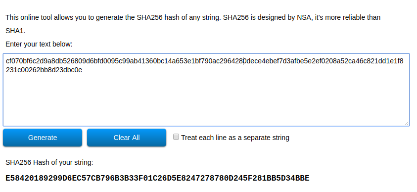
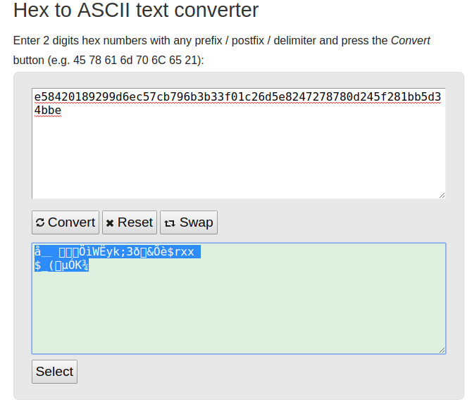
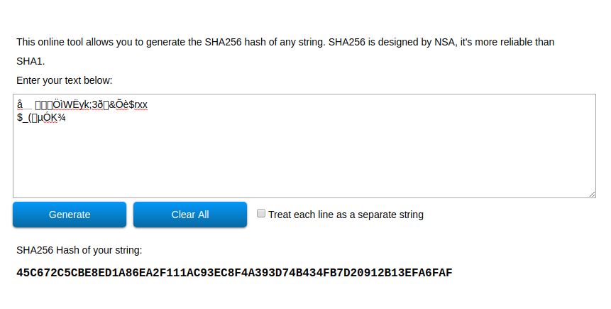
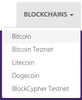
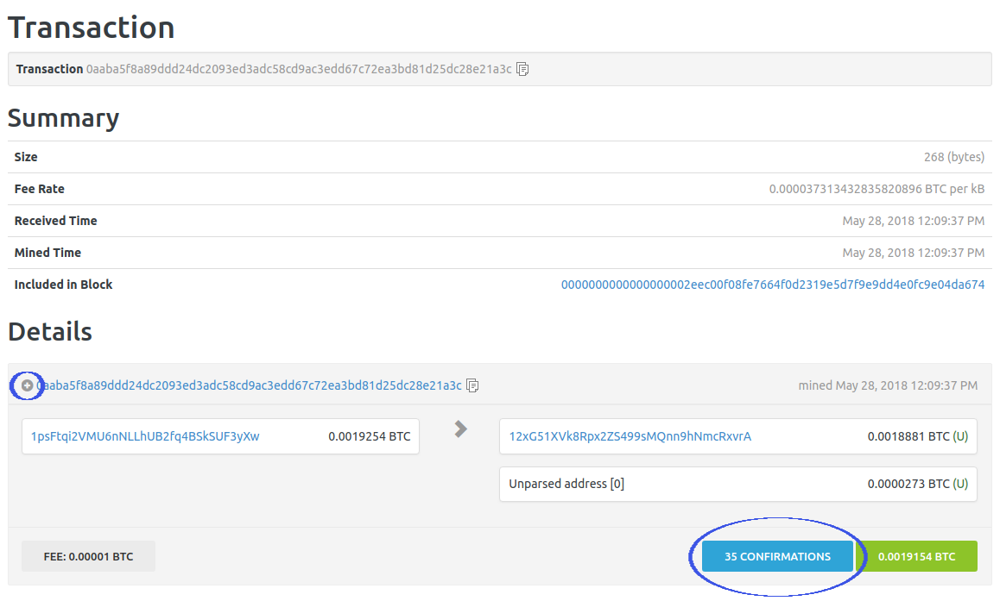
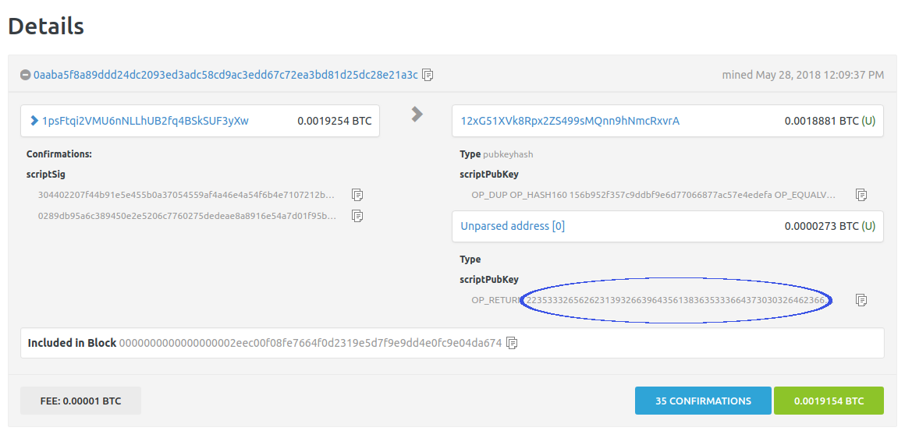

  


# Istruzioni per la verifica autonoma su Blockchain della ricevuta di notarizzazione


## 1	Introduzione
Con questo documento vogliamo spiegarti come verificare autonomamente la correttezza e la veridicità dei dati presenti sulla tua ricevuta di notarizzazione.
Banca Popolare di Sondrio ti garantisce che i dati siano correttamente scritti sulla blockchain (un registro aperto e distribuito che può memorizzare le transazioni tra due parti in modo sicuro, verificabile e permanente) ma, con delle competenze informatiche di base, puoi provare anche tu ad effettuare la verifica da solo.

Tutti i passi spiegati in questa guida sono implementati in una **[pagina di verifica automatica](https://gianpaolo-m.github.io/verifica-notarizzazione-blockchain/)** nella quale si può caricare la ricevuta per la verifica.
 

## 2	Cosa verificare?
Potrai verificare quanto riportato nella ricevuta del servizio in due fasi:

1.	Verificare la consistenza dei dati presenti nella ricevuta;
2.	Verificare la presenza dei dati su blockchain.

La prima fase consiste nell’effettuare alcuni calcoli con l'ausilio di un computer, a partire dai dati riportati nella ricevuta. In questo modo potrai verificare la consistenza di quanto dichiarato sul documento.

La seconda fase consiste nel verificare la presenza su blockchain dei risultati calcolati durante la fase precedente, tramite l’utilizzo di servizi erogati da terzi indipendenti. Tali servizi sono portali web che consentono agli utenti di interrogare direttamente la blockchain tramite interfaccia visuale o API.
L'indipendenza dei portali rispetto all'erogatore del servizio di notarizzazione (BPS) fornisce una ulteriore garanzia di trasparenza al processo.

Il servizio di notarizzazione non scrive sulla blockchain i tuoi dati in chiaro, bensì in forma offuscata e aggregata, in modo da non rendere possibile risalire al dato originale. Il dato scritto in blockchain è chiamato Merkle Root ed è il risultato di un processo di aggregazione noto con il nome Merkle Tree .

#### Cos’è il Merkle Tree?  

In letteratura informatica, un hash tree o merkle tree è una struttura ad albero le cui foglie rappresentano blocchi di dati sotto forma di hash, una funzione non invertibile che mappa una stringa di lunghezza arbitraria in una stringa di lunghezza minore. La caratteristica principale del merkle tree è di permettere una verifica efficiente e sicura di strutture dati di grandi dimensioni.
Dimostrare l’appartenenza di una data foglia (dato di input) ad un merkle tree necessita infatti un numero di computazioni proporzionale al logaritmo del numero delle foglie di quel determinato merkle tree.

    
Figura 0- Schema Merkle Tree

## 3	Struttura della ricevuta
Il servizio fornisce tramite la ricevuta tutte le informazioni necessarie alla verifica autonoma dell'avvenuta notarizzazione. La ricevuta è divisa in cinque sezioni, ogni sezione contiene una specifica serie di dati:

*	Dato utente notarizzato – contiene i dati in chiaro dell’utente, da cui si genera un dato offuscato, la hash, dalla quale è impossibile risalire ai dati originali);
Esempio:

``` 
{NumeroPolizza:"01372602345678",DataScadenza:"01/07/2019",TargaVeicolo:"AB001YZ",
DescrizioneProdotto:"TUTTO TONDO - ARCA ASSICURAZIONI",DataConsenso:"25/05/2018"}
```

*	Dati di notarizzazione – contiene i dati relativi alla transazione utilizzata per notarizzare l’evento sulla blockchain;
Esempio:
``` 
{"blockchain":"Bitcoin-mainnet","transactionSentTime":1527501611054,
"transactionId":"0aaba5f8a89ddd24dc2093ed3adc58cd9ac3edd67c72ea3bd81d25dc28e21a3c","status":"CONFIRMED"}
```

*	Dati del Merkle Tree – contiene alcune delle informazioni necessarie a ricostruire il dato scritto in blockchain
Esempio:
``` 
{"merkle":{"root":"532ebb192f9d5a86536d7002db6dc635c8536f453d133b45197aebd4e89752bf","index":1,
"hash":"0dece4ebef7d3afbe5e2ef0208a52ca46c821dd1e1f8231c00262bb8d23dbc0e"}} 
```

*	Siblings 1 - Questa è la prima serie di dati (detti siblings), i quali consistono negli elementi da combinare all’hash del tuo dato allo scopo di ottenere il merkle root (dato scritto in blockchain)

Esempio:
``` 
{"siblings_1":["cf070bf6c2d9a8db526809d6bfd0095c99ab41360bc14a653e1bf790ac296428",
"878f9d366614390744924087fecd3908257b0409708ae0abef8a1417408e5ebb",
"aa21611d9bef73cd8283d4b40a7338e21f0a6cbbd2d2dfdf9eba752e21e17b60"]}
```

•	Siblings 2 - Questa è la seconda serie di dati, i quali consistono (in modo identico a quanto sopra) negli elementi da combinare all’hash del tuo dato allo scopo di ottenere il merkle root (dato scritto in blockchain)
**N.B.** La sezione Sibilings 2 potrebbe **non** contenere alcun hash nel caso di alberi di dimensione ridotta.

Esempio:

``` 
{"siblings_2":[]} 
```


## 4	Verifica della consistenza dei dati del documento
### 4.1	Validazione dell’hash dei dati notarizzati
La prima cosa che devi verificare è che la versione offuscata del tuo dato sia stata correttamente inserita nel Merkle Tree. Per fare questo:

1.	Applica la funzione di hashing al testo contenuto nel riquadro della ricevuta di notarizzazione (**“Dati Notarizzati”**), mediante l’algoritmo Sha256.
   **N.B.** ricordati - in prima battuta - di sostituire i simboli ÷ (Codice ASCII: 246) con degli **spazi bianchi** e di **togliere gli “a capo”** portando tutto su una riga. 
   A questo punto è possibile effettuare l'hashing usando gli strumenti del tuo sistema operativo oppure cercando online dei convertitori da testo a sha256. 
   Verifica con attenzione che durante la procedura di copia della stringa non siano stati inseriti dei caratteri spuri (tipicamente vengono inseriti degli "a capo" dovuti alla formattazione del PDF).
   Controlla che il risultato della funzione di hashing sia uguale alla stringa contenuta nel campo **"hash"** della sezione **“Dati del Merkle Tree”** della ricevuta.


### 4.2	Validazione del Merkle Root

La seconda cosa che devi verificare è che il Merkle Root sia effettivamente il risultato dell'aggregazione dell'hash calcolato al punto precedente e dei siblings.

- Dati 
  - l’hash dei dati di notarizzazione (calcolato al punto 4.1),
  - il suo indice nell’albero (campo index del JSON contenuto nel riquadro **“Dati del Merkle Tree”**)
  - il primo siblings contenuto nel riquadro **“Siblings 1”**: 

1. Concatena l’hash dei dati di notarizzazione con quelli del primo sibling secondo l’ordine indicato dal parametro **index**, come indicato nel seguente esempio:
   - se index è **pari** (mod(index)=0), allora la stringa hash va posta prima della stringa sibling (hash+sibling);
   - se index è **dispari** (mod(index)>0), allora la stringa hash va posta dopo la stringa sibling (sibling+hash);
**Applica l’operazione di hashing al risultato della concatenazione**
   
Figura 1 - hash(sibling+hash)

2. Il risultato dell'operazione di hashing precedente va decodificato da stringa esadecimale in testo semplice (utilizza un servizio online di conversione esadecimale-testo). Non ti preoccupare se il risultato contiene caratteri non convenzionali (si veda la figura 2).

 
  
Figura 2 - Esadecimale decodificato

3. La stringa di testo così ottenuta va **nuovamente sottoposta all'algoritmo di hash** .

  
 Figura 3 - Hashing della stringa decodificata

4. Ripeti i passi 1, 2 e 3 fino a che non hai finito entrambi gli elenchi di siblings, facendo attenzione a rispettare l’ordine in cui ti sono elencati sulla ricevuta e controllando sempre l’indice, in modo da non sbagliare la concatenazione
5. Il risultato dell’ultima combinazione deve subire una trasformazione ulteriore: **l’inversione del testo**. Questa inversione viene effettuata secondo lo schema seguente:
   - Effettuare un doppio hash (effettuare un hash del risultato ottenuto sopra, convertire a testo ed effettuare un nuovo hash)
   - Conversione del risultato al punto sopra da esadecimale a testo semplice
   - Inversione della stringa (ad esempio la stringa "ABCD" diventerà  "DCBA")
   - Conversione del risultato del punto sopra da testo semplice ad esadecimale 
Fatto questo avrai ottenuto il Merkle Root;

6. Verifica che il merkle root ottenuto al passo precedente sia uguale con quello contenuto nel campo root del JSON contenuto nel riquadro “Dati del Merkle Tree"

## 5 Verifica della presenza dei dati su blockchain

A questo punto puoi procedere a verificare se il Merkle Root sia effettivamente stato scritto sulla Block Chain. 

* Inserisci il transactionID dal riquadro “Dati di Notarizzazione” nella barra di ricerca di un portale di block-tracking, come ad esempio uno tra quelli suggeriti di seguito. 
* Verifica se i dati corrispondono a quelli riportati sulla ricevuta, facendo attenzione che i dati riportati dal portale si riferiscano alla blockchain indicata nel campo blockchain del riquadro “Dati di notarizzazione”. 

Alcuni portali permettono di selezionare la blockchain che, nel nostro caso, è “Bitcoin”.

   
Figura 4 - Menù di selezione della blockchain

Altri hanno domini separati:

* [blockexplorer.com](https://blockexplorer.com/) per la rete principale di bitcoin
* [testnet.blockexplorer.com](https://testnet.blockexplorer.com/) per la rete di test di bitcoin

Altri esempi di portali di tracking delle transazioni:

* [blockchain.info](http://www.blockchain.info/)
* [live.blockcypher.com](https://live.blockcypher.com/)
* [chain.so](https://chain.so/btc)

Procediamo prendendo come esempio BlockExplorer. 
Incolla l'id transazione nella barra di ricerca, verrà aperta una pagina contenente tutte le informazioni relative alla transazione. 

E' importante verificare che il numero di conferme - cerchiato in basso a destra - sia superiore a sei, numero che convenzionalmente identifica transazioni confermate in modo stabile dalla rete.

Per poter verificare che il payload della transazione coincida col Merkle Root che hai calcolato in precedenza, bisogna cliccare sul simbolo “+” evidenziato dall’immagine.

   
Figura 5 - informazioni transazione su portale web BlockExplorer

Al click verrà aperta una schermata che visualizza nel dettaglio il contenuto della transazione. 
Decodifica la stringa cerchiata di rosso nell’immagine sottostante (vedi passo 2, Capitolo 4.2) e verifica che il risultato sia identico al Merkle Root riportato sulla ricevuta.

   
Figura 6- Dettaglio transazione

A questo punto la verifica è terminata ed hai potuto constatare autonomamente l’avvenuta notarizzazione.